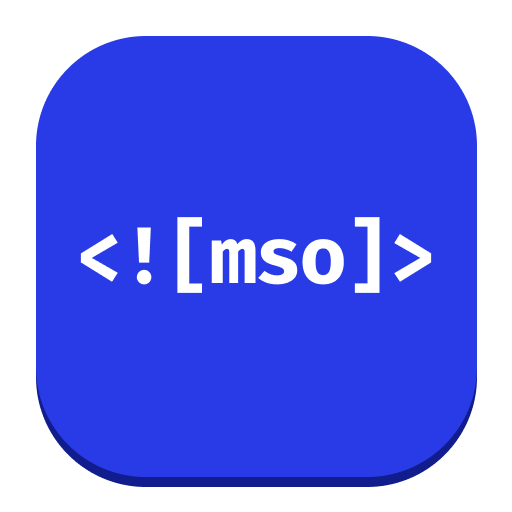
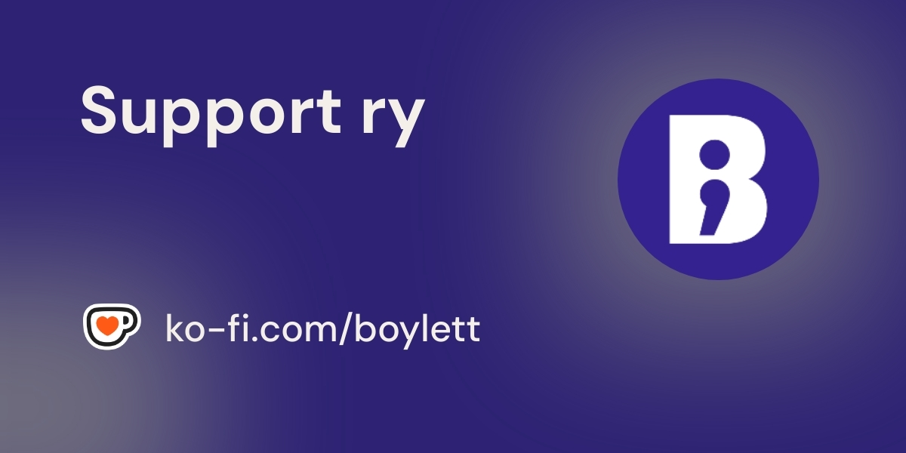

<div align="center">



# MSO Tools

[](https://marketplace.visualstudio.com/items?itemName=boylett.mso-tools)

Syntax highlighting, hovers, diagnostics, and snippets for HTML email developers working with Microsoft Outlook's MSO conditional comments, MSO CSS, VML, and Office namespace tags - so Outlook-only blocks stop looking like noise and start looking like Outlook-only blocks.

</div>

## Install

Open the Extensions view in VS Code (`Ctrl/Cmd+Shift+X`), search for **MSO Tools**, hit **Install** - or grab it from the [Marketplace](https://marketplace.visualstudio.com/items?itemName=boylett.mso-tools).

## Features

### Syntax highlighting

Injection grammars that layer on top of the existing HTML, PHP, and CSS highlighters:

- **MSO conditional comments** - `<!--[if mso]>`, `<!--[if !mso]><!-->`, `<![endif]-->`, `<!--<![endif]-->`, plus `gte`/`lte`/`gt`/`lt` version comparisons and `IE` variants. Marker punctuation blends with regular HTML comment colour; the `if`/`endif` keyword and target (`mso`/`IE`) are themed as preprocessor directives.
- **MSO CSS properties** - every `mso-*` property (line-height-rule, padding-alt, table-lspace, etc.) is recognised inside `<style>` blocks and standalone CSS.
- **VML and Office tags** - `<v:rect>`, `<v:roundrect>`, `<v:fill>`, `<o:OfficeDocumentSettings>`, `<o:AllowPNG/>`, `<xml>` and friends, with their attributes (`fillcolor`, `coordsize`, `arcsize`, etc.).
- **HTML "marker" comments** - `<!-- * Block Name -->` and `<!-- * // Block Name -->` for collapsible region labels.
- **Yahoo Mail conditional CSS** - `@media screen yahoo` is highlighted as a Yahoo-only directive.

### Italic conditional content

Code inside an MSO conditional comment is rendered in italic to make Outlook-only blocks visually distinct from the surrounding HTML.

### Folding

Code folding is provided for both MSO conditional blocks and HTML marker blocks. The closing tag stays visible on its own line below the fold, so when a region is collapsed you see `open ... close` and the close tag retains full syntax highlighting.

### Match highlighting

Click inside any of the following and the matching counterpart lights up the same way regular HTML tag pairs do:

- `<!--[if mso]>` and `<![endif]-->`
- `<!--[if !mso]><!-->` and `<!--<![endif]-->`
- `<!-- * Block Name -->` and `<!-- * // Block Name -->`
- `<v:rect>` and `</v:rect>` (and any `v:*`, `o:*`, `w:*`, `<xml>` pair)

Self-closing VML and Office tags (e.g. `<o:AllowPNG/>`, `<v:fill/>`) self-highlight when selected.

### Autocomplete

- **HTML autocomplete** for VML, Office, and `<xml>` tags - typing `<v:`, `<o:`, `<w:`, or `<xml` surfaces the relevant tags with descriptions and known attributes. Powered by VSCode's `html.customData` mechanism.
- **HTML autocomplete** for `xmlns:v`, `xmlns:o`, and `xmlns:w` namespace declarations on the `<html>` element.
- **MSO conditional comment templates** appear in the completion list when typing `<!--`, `<!--[`, or `<!`. Pick from `<!--[if mso]>`, `<!--[if !mso]><!-->`, `<!--[if gte mso 9]>`, `<!--[if lte mso 11]>`, and `<!--[if IE]>`.
- **MSO CSS property autocomplete** in standalone `.css` files (via the registered MSO custom data file) and inside HTML/PHP `<style>` blocks and `style="..."` attributes (via a dedicated completion provider).

### Hover documentation

Hover any of the following for a description, usage notes, and an example:

- MSO CSS properties (60+ entries)
- VML and Office tags including `<xml>` and `<o:OfficeDocumentSettings>`
- VML attributes
- Conditional-comment keywords (`mso`, `IE`, `if`, `endif`, `gte`, `lte`, `gt`, `lt`) and version numbers
- The `yahoo` keyword in `@media screen yahoo`

### Diagnostics

| Rule | Severity | Example |
|------|----------|---------|
| Unmatched `<!--[if ...]>` | Warning | `<!--[if mso]>` with no `<![endif]-->` |
| Stray `<![endif]-->` | Warning | `<![endif]-->` with no preceding open |
| Unknown `mso-*` property | Warning | `mso-line-hieght-rule:` (suggests `mso-line-height-rule`) |
| VML used without xmlns | Warning | `<v:rect>` present but no `xmlns:v` on `<html>` |
| Unknown VML attribute | Warning | `<v:rect filcolor="...">` (suggests `fillcolor`) |
| Unknown VML tag | Information | `<v:rect2>` (suggests `<v:rect>`) |
| Missing `role="presentation"` | Warning | `<table>` without an accessibility role |

### Quick fixes

A code action is offered for any `<table>` flagged as missing `role="presentation"`. It inserts the attribute right after the tag name.

### Snippets

Type one of these prefixes inside an HTML or PHP file:

| Prefix | Inserts |
|--------|---------|
| `mso-if` | `<!--[if mso]>` ... `<![endif]-->` |
| `mso-ifnot` | `<!--[if !mso]><!-->` ... `<!--<![endif]-->` |
| `mso-if-gte9` | `<!--[if gte mso 9]>` ... `<![endif]-->` |
| `mso-button` | Bulletproof VML roundrect button with non-Outlook fallback |
| `mso-bg` | VML rect with imagedata for a background image |
| `mso-hide-mso` | Wrap selection so Outlook hides it |
| `mso-hide-non-mso` | Wrap selection so non-Outlook clients hide it |

## CSS validation defaults

VSCode's CSS validator can't be taught about email-specific syntax: `mso-*` properties trigger "Unknown property" warnings, `@media screen yahoo` trips a `{ expected` parser error, and so on. CSS custom data only covers properties and at-rules, not media types, so partial fixes aren't possible.

To silence these false positives, MSO Tools applies two `configurationDefaults`:

| Setting | Value | Effect |
|---------|-------|--------|
| `css.lint.unknownProperties` | `ignore` | Suppresses "Unknown property" warnings (covers `mso-*` in standalone `.css` files) |
| `html.validate.styles` | `false` | Disables embedded CSS validation inside HTML `<style>` blocks (covers all the email hacks) |

Trade-offs:

- Standalone `.css` files keep full CSS validation except the unknown-property warning.
- HTML `<style>` blocks lose all CSS validation - syntax errors, duplicates, etc. all stop reporting. For email work this is generally fine since email CSS is full of "errors" that aren't actually errors.
- The extension's own diagnostics (unknown `mso-*` with did-you-mean, unmatched conditional comments, VML namespace/attribute checks, missing `role="presentation"`) keep firing regardless.

To re-enable either piece of validation, add to your settings:

```jsonc
"css.lint.unknownProperties": "warning",
"html.validate.styles": true
```

MSO Tools also registers its bundled MSO custom data file with VSCode's CSS language service on activation, so `mso-*` properties get autocomplete and hover documentation in standalone `.css` files. The entry is removed from your settings on uninstall.

## Theme note - bold preprocessor styling

Conditional-comment keywords (`if`, `endif`, `mso`, `gte`, etc.) are tagged with the scope `keyword.control.directive.conditional.mso`. Most popular themes (Default Dark+, GitHub, One Dark Pro, Dracula) already render `keyword.control.directive` in a bold, distinct style.

If your theme doesn't make them stand out, drop this into your `settings.json`:

```jsonc
"editor.tokenColorCustomizations": {
  "textMateRules": [
    {
      "scope": "keyword.control.directive.conditional.mso",
      "settings": {
        "fontStyle": "bold",
        "foreground": "#C586C0"
      }
    }
  ]
}
```

## Support

If this is useful to you and you'd like to support its development, you can buy me a coffee on Ko-fi - always optional, always appreciated.

<a href="https://ko-fi.com/boylett"></a>

## License

MIT - see [LICENSE](LICENSE).
